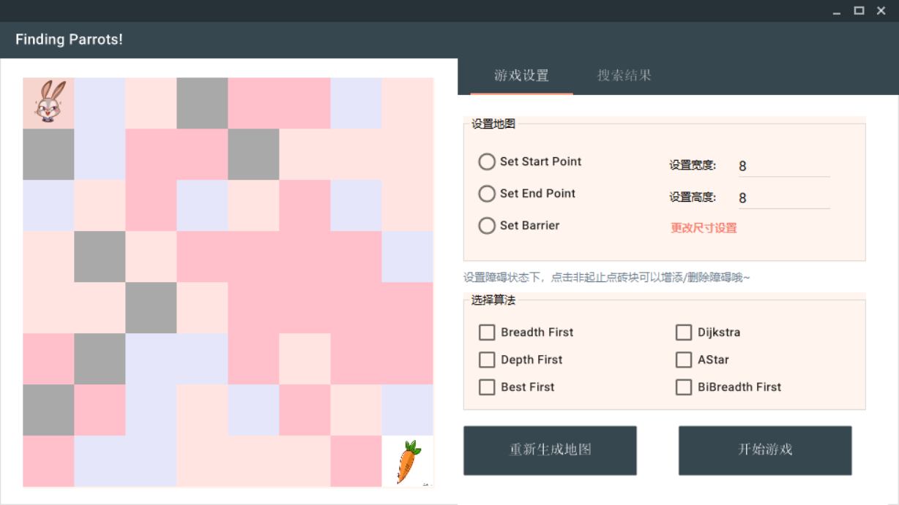
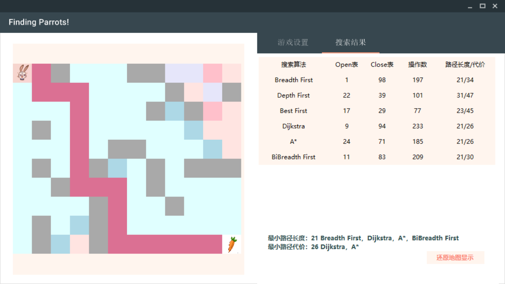

# 人脸图像变形

### 1.程序运行环境

​	**Environment**：Windows10+VS2017

​	**Language**：Landmarks Detection：C++ ；Face fusion：C#

​	**Library**：OpenCV3.44；dlib19.16	

### 2.文件说明

​        **Fusion**：人脸图像变形的C#程序

​        **Library**：第三方库dlib19.16

​        **Input**：可供测试的输入文件

​        **EXE**：可执行的程序

​	This project is aimed to fuse two human faces with TPS or B-Splines method. The pictures that can be used for testing are stored in  "Input" in JPG format. The third party library (OpenCV not included) is provided in  "EXE". The C# project of facial detection is in "Fusion" while the main.cpp is used for landmarks detection.

### 3.运行操作

#### **人脸变形**：

   	运行人脸变形程序HMW1.exe     

​	选择任意一种`变形方式`+`插值方式`组合，点击`开始变换`，人脸变形开始；

​        进度条显示变形进度，变形结束后新图片将在最右侧窗格显示；

​        点击`还原图片`变形效果消失，便于观察变形效果;

​        点击`选择图片`可以选择该计算机上任意本地图片（建议选择jpg格式）

​        点击任意图片可以查看原图；

​        点击`保存图片`可以将图片存在本地任意目录下；

​      （注：未选择变形方式与插值方式时，将弹出消息框提醒不能进行图像变换；所选择图片的当前目录下没有人脸关键点检测信息时，消息框将弹出提醒需要首先进行人脸关键点检测)

#### **人脸检测:**

​        命令行进入Project1.exe所在目录下`..\EXE`

​        输入Project1.exe 照片路径（中间为一个空格）人脸检测程序将开始执行，例如：

~~~C++
Project1.exe ..\Input\11.jpg
~~~

​        由于程序运行较慢，大约需要1~2分钟，请耐心等待，出现灰色窗体时表明正在检测，请不要关闭窗体.

​        程序成功运行后会显示检测到的人脸与标注关键点后照片,相应关键点坐标将存入当前目录下同名.txt中；每次程序运行只能检测一张图片，按“Enter”键可退出程序；处理同名照片时，原先存储关键点信息的.txt文件会相应地被覆盖；未防止程序出现异常，除测试集提供的照片外请勿提交具有多张人脸的照片.

​        经过人脸检测后，运行人脸变形程序HMW1.exe，选择被检测图片路径，即可进行人脸变换.

### 3.第三方库配置

**OpenCV配置**

- 下载openCV 3.44

- 将openCV中的bin文件添加到系统路径

- 在VS属性管理器 Debug|x64 属性中选择VC++目录->包含目录，添加文件夹路径：

  ~~~C++
  ..\opencv\build\include
  ..\opencv\build\include\opencv
  ..\opencv\build\include\opencv2
  ~~~

- 在VC++目录->库目录下添加文件夹路径：`..\opencv\build\x64\v15\lib`

- 链接器->附加依赖项添加`opencv_world344d.lib`

**Dlib配置**

- 在 Debug|x64 属性中VC++目录->包含目录，引用目录，库目录添加文件夹路径`..\dlib-19.16`

- 在链接->输入->附加依赖项添加`dlib.lib`
- 在链接->输入->常规->附加库目录中添加`..dlib-building\Debug`

 参考资料：

https://blog.csdn.net/hit_sirius/article/details/79166041

https://yq.aliyun.com/ziliao/550455

### **4.其他说明:**

关于程序运行有任何其他疑问请联系：

Author: Zhong Qingyang 

Email:  [zhongqy16@mails.tsinghua.edu.cn]()  
